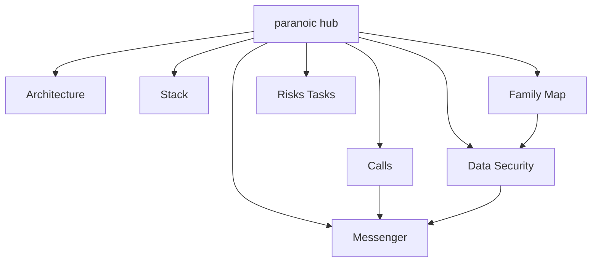

# Paranoic

> Хаб продукта **Paranoic** — зашифрованный мессенджер + карта Family.  
> В **Graph View** фильтр: `tag:#paranoic` — отдельное созвездие, не смешивать с Garbagin.

**Репо:** https://github.com/sgurzheyev/paranoic · **локально:** `~/paranoic` · **Android:** `men.paranoic.app` v1.2

←→ [[🗺️ GARBAGIN Master Index|Garbagin]] (другой продукт)

---

## Карта заметок

| Заметка | О чём |
|---------|--------|
| [[Paranoic/Architecture]] | Режимы, shell, навигация, модули |
| [[Paranoic/Stack]] | React/Vite/Capacitor/Supabase/Mapbox |
| [[Paranoic/Messenger]] | Чаты, группы, контакты, E2EE путь |
| [[Paranoic/Calls]] | 1:1, mesh, signaling, текущий баг |
| [[Paranoic/Family Map]] | GlobeLobby, memory gems, visibility |
| [[Paranoic/Data Security]] | Хранилища, RLS, R2, trust/block |
| [[Paranoic/Risks Tasks]] | Аудит, риски, активные задачи |
| [[Paranoic/What Works]] | Что уже работает |
| [[Paranoic/Audit 2026-09-12]] | Статус WORKS/PARTIAL/BROKEN/MISSING |
| [[Paranoic/Feature Resolution]] | Резолюция фич vs WA/TG/Signal |

**Canvas:** [[Paranoic Graph]]

---

## Коротко о продукте

Два режима после логина:

- **Paranoic** — чаты, группы, звонки, E2EE
- **Family** — карта Mapbox, memory gems (private / family / public)

Privacy-first: локальная адресная книга, Ghost Mode, cloud sync trust/block, offline store-and-forward.

---

## Сейчас в фокусе

См. [[Paranoic/Calls]] и [[Paranoic/Risks Tasks]]:

1. Починить **соединение 1:1** звонков  
2. Затем **group calls** (mesh)  
3. Обновить `APP_AUDIT.md`

---

## Обратные ссылки

Все дочерние заметки линкуют сюда: [[paranoic]].
